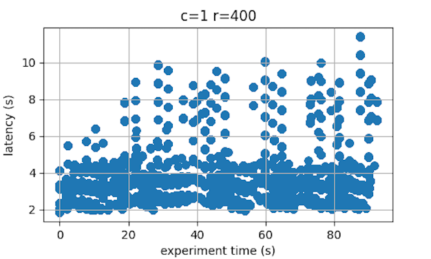
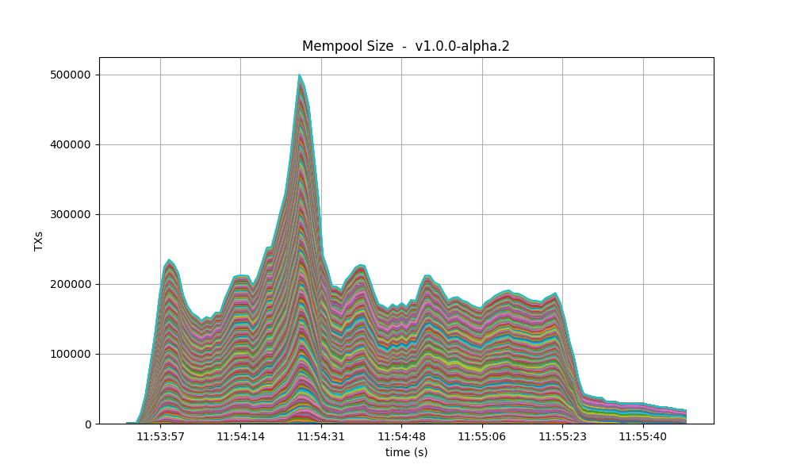
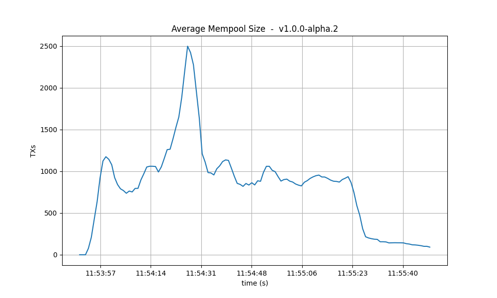
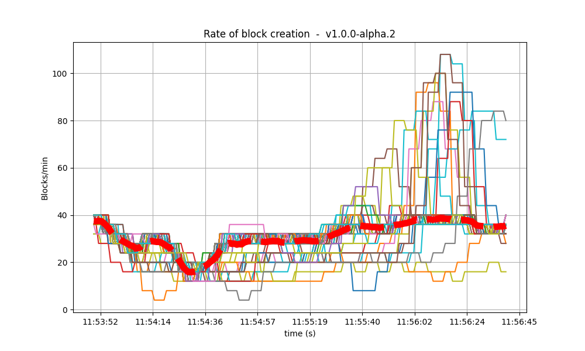
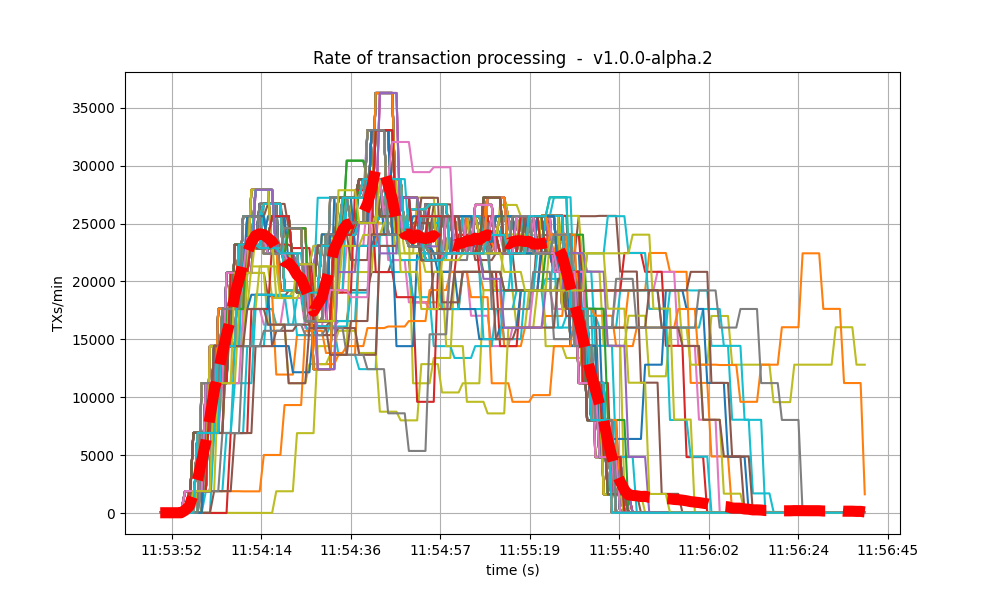
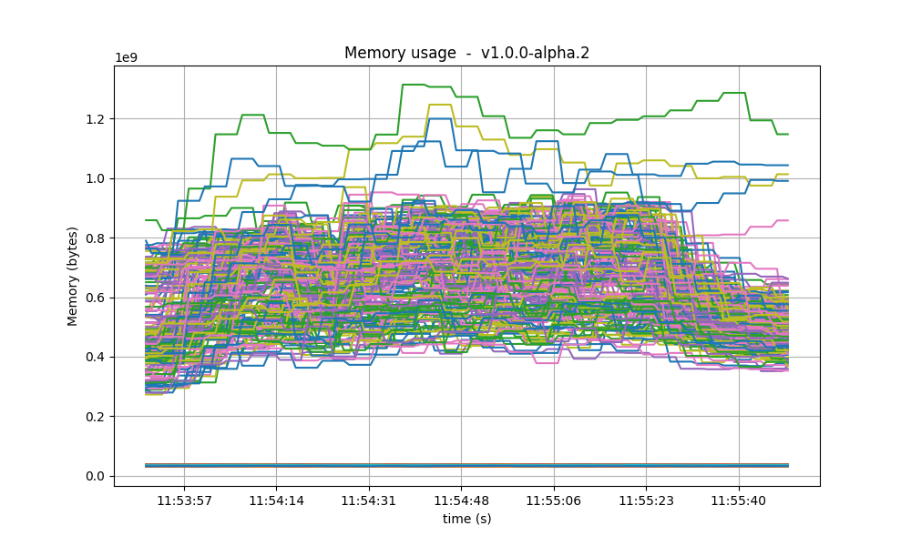
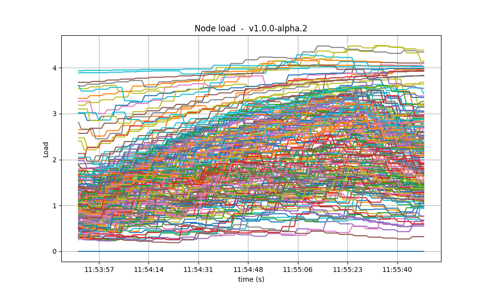

# QA results for CometBFT v1.x

We run this iteration of the QA tests on CometBFT `v1.0.0-alpha.2`, the second tag of the backport
branch `v1.x` from the CometBFT repository. The previous QA tests were performed on
`v0.38.0-alpha.2` from May 21, 2023, which we use here as a baseline for comparison. There are many
changes with respect to the baseline, including `TO COMPLETE`. For the full list of changes, check
out the [CHANGELOG](https://github.com/cometbft/cometbft/blob/v1.0.0-alpha.2/CHANGELOG.md).

As in other iterations of our QA process, we have used a network of 200 nodes as testbed, plus one
node to load transactions and another to collect metrics. The main steps of the QA process are the
following:
- [Saturation point](#saturation-point): Find the saturation point of the network, that is,
  the transaction load on which the system begins to show a degraded performance. 
- [200-nodes test](#200-nodes-test): During a fixed amount of time, inject on the 200-nodes network
  a constant load with a value slightly below the saturation point. Then collect metrics and block
  data to compute latencies, and compare them against the results of the baseline.
- [Rotating-nodes test](#rotating-nodes-test): Run initially 10 validators and 3 seed nodes. Then
  start a full node, wait until it is block-synced, and stop it. Repeat this step 25 times while
  checking the nodes are able to catch up to the latest height of the network.

Additionally, for this version, we perform the following experiments.
- `TO COMPLETE`
- ...

The main goal of the QA process is to validate that there are no meaningful, substantial regressions
from the previous version. We consider that there is a regression if we find a difference bigger
than 10% in the results. After performing these tests, we have concluded that there are no
significant differences with respect to the baseline, therefore version `v1.0.0-alpha.2` has passed
the QA validation.

## Table of Contents
- [Saturation point](#saturation-point)
- [200-nodes test](#200-nodes-test)
  - [Latencies](#latencies)
  - [Metrics](#metrics)
  - [Results](#results)
- [Rotating-nodes test](#rotating-nodes-test)

## Saturation point

The first step of our QA process is to find the saturation point on a network of 200 nodes. Then we
run the experiments with the system subjected to a load slightly under the saturation point. The
method to identify the saturation point is explained [here](CometBFT-QA-34.md#saturation-point) and
its application to the baseline is described [here](TMCore-QA-37.md#finding-the-saturation-point).

The following table summarizes the results for the different experiments (extracted from
[`v1_report_tabbed.txt`](imgs/v1/200nodes/metrics/v1_report_tabbed.txt)). The X axis (`c`) is the
number of connections created by the load runner process to the target node. The Y axis (`r`) is the
rate or number of transactions issued per second. Each connection sends `r` transactions per second.

|        | c=1       | c=2       | c=4   |
| ------ | --------: | --------: | ----: |
| r=200  | 17800     | **34600** | 50464 |
| r=400  | **31200** | 54706     | 49463 |
| r=800  | 51146     | 51917     | 41376 |
| r=1600 | 50889     | 47732     | 45530 |

We observe in the table that the system is saturated beyond the diagonal defined by the entries
`c=1,r=400` and `c=2,r=200`. Entries in the diagonal have the same amount of transaction load, so we
can consider them equivalent. For the chosen diagonal, the expected number of processed transactions
is `1 * 400 tx/s * 89 s = 35600`. (Note that we use 89 out of 90 seconds of the experiment because
the last transaction batch coincides with the end of the experiment and is thus not sent.) For the
experiments just below the diagonal we would expected double that number, that is, `1 * 800 tx/s *
89 s = 71200`, but the system is not able to process such load, so some transactions are dropped.

For comparison, this is the table obtained on the baseline version, where the saturation point is
also beyond the diagonal defined by `c=1,r=400` and `c=2,r=200`.
|        | c=1       | c=2       | c=4   |
| ------ | --------: | --------: | ----: |
| r=200  | 17800     | **33259** | 33259 |
| r=400  | **35600** | 41565     | 41384 |
| r=800  | 36831     | 38686     | 40816 |
| r=1600 | 40600     | 45034     | 39830 |

In conclusion, we chose `c=1,r=400` as the transaction load that we will use in the rest of QA
process. This is the same value used in the previous QA tests.

## 200-nodes test

We run experiments with the system subjected to a load slightly under the saturation point.

### Latencies

The following figures show the latencies of the experiment carried out with the configuration
`c=1,r=400`.

v0.38 | v1 | v1 with LE
:--------------:|:--------------:|:--------------:
 |  

As can be seen, in most cases the latencies are very similar, and in some cases,
the baseline has slightly higher latencies than the version under test. Thus,
from this small experiment, we can say that the latencies measured on the two
versions are equivalent, or at least that the version under test is not worse
than the baseline.

### Metrics

We further examine key metrics extracted from Prometheus data on the experiment with configuration
`c=1,r=400`.

#### Mempool size

The mempool size, a count of the number of transactions in the mempool, was shown to be stable and
homogeneous at all full nodes. It did not exhibit any unconstrained growth. The figures below show
- in the first row, the evolution over time of the cumulative number of transactions inside all full
nodes' mempools at a given time.
- in the second row, the evolution of the average mempool size over all full nodes, which mostly
stays below 1000 outstanding transactions except for a peak above 2000, coinciding with the moment
the system reached round number 1 (see below); this is better than the baseline, which oscilates
between 1000 and 2500.

v0.38 | v1 | v1 with LE
:--------------:|:--------------:|:--------------:
 | 
 | 

#### Peers

The number of peers was stable at all nodes. As expected, the seed nodes have more peers (around
125) than the rest (between 20 and 70 for most nodes). The red dashed line denotes the average
value.

v0.38 | v1 | v1 with LE
:--------------:|:--------------:|:--------------:
 | 

Just as in the baseline, the fact that non-seed nodes reach more than 50 peers is due to [\#9548].

#### Consensus rounds

Most blocks took just one round to reach consensus, except for a few cases when it was needed a
second round. For these specific runs, the baseline required an extra round more times.

v0.38 | v1 | v1 with LE
:--------------:|:--------------:|:--------------:
 | 

#### Blocks produced per minute and transactions processed per minute

The first line of plots show the rate in which blocks were created, from the point of view of each
node. That is, they shows when each node learned that a new block had been agreed upon. For most of
the time when load was being applied to the system, most of the nodes stayed around 20
blocks/minute. The spike to more than 100 blocks/minute is due to a slow node catching up. The
baseline experienced a similar behavior.

v0.38 | v1 | v1 with LE
:--------------:|:--------------:|:--------------:
 | 
 | 

The collective spike on the right of the graph marks the end of the load
injection, when blocks become smaller (empty) and impose less strain on the
network. This behavior is reflected in the following graph, which shows the
number of transactions processed per minute.

#### Memory resident set size

The following graphs show the Resident Set Size of all monitored processes. Most nodes use less than
0.9 GB of memory, and a maximum of 1.3GB. In all cases, the memory usage in this run is less than
the baseline. On all processes, the memory usage went down as the load was being removed, showing no
signs of unconstrained growth.

v0.38 | v1 | v1 with LE
:--------------:|:--------------:|:--------------:
 |  |

#### CPU utilization

The best metric from Prometheus to gauge CPU utilization in a Unix machine is `load1`, as it usually
appears in the [output of
`top`](https://www.digitalocean.com/community/tutorials/load-average-in-linux). In this case, the
load is contained below 4 on most nodes, with the baseline showing a similar behavior.

v0.38 | v1 | v1 with LE
:--------------:|:--------------:|:--------------:
 | 

### Test Results

We have shown that there is no regressions when comparing CometBFT v1.0.0-alpha.2 against the
results obtained for v0.38. The observed results are equal or sometimes slightly better than the
baseline. We therefore conclude that this version of CometBFT has passed the test.

| Scenario  | Date       | Version                                                   | Result |
| --------- | ---------- | --------------------------------------------------------- | ------ |
| 200-nodes | 2024-03-21 | v1.0.0-alpha.2 (4ced46d3d742bdc6093050bd67d9bbde830b6df2) | Pass   |

## Rotating-nodes test

`... TO COMPLETE ...`

[\#9548]: https://github.com/tendermint/tendermint/issues/9548
[end-to-end]: https://github.com/cometbft/cometbft/tree/main/test/e2e
